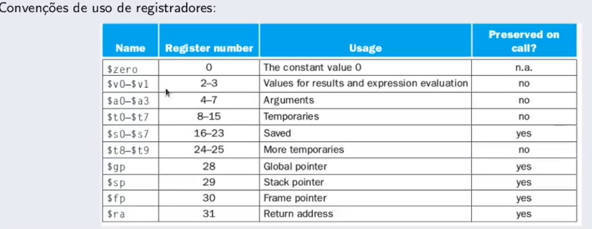

# Anotações para aula A de MIPS

## Abstração
 
* Não é necessário saber o que esta acontecendo por tras das cortinas, pois a interface abstrai os funcionamentos por tras dela, possibilitando que voce se concentre naquele ponto;

## Programação
* O compilador transforma o codigo em linguagem de montagem, que é a mesma coisa que o codigo compilado, mas de uma forma que o processador entende. O nome dessa linguagem é assembly. A transformação em linguagem de máquina costuma ser reversível.

* Depois de transformado em assembly, o programa deve ser carregado na memoria para ser executado.

* O processador digital é um automato que é programável que tem 3 missoes: fazer o fetch (buscar instrução na memoria), decodificá-la e executá-la.

# Anotações para aula B de MIPS
 
 A arquitetura usada sera RISK, ou seja, simples (em contrapartida da CISK). Hoje em dia, a maioria dos processadores usam conceitos advindos dessas duas filosofias.

Por que Assembly para MIPS (Microprocessor Without Interlocked Pipeline Stages)
 * Linguagem similar a ARMv7.

## A CPU MIPS contém 32 registradores de uso geral numerados de 0 a 31. O registrador n é designado po $n.
* Ela contém CPU (soma subtração). PPU (Pontos flutuantes), Coprocessor 0 (exceções)
 - Os registradores são as melhores tipos de memórias

#Especificações dos Registradores

