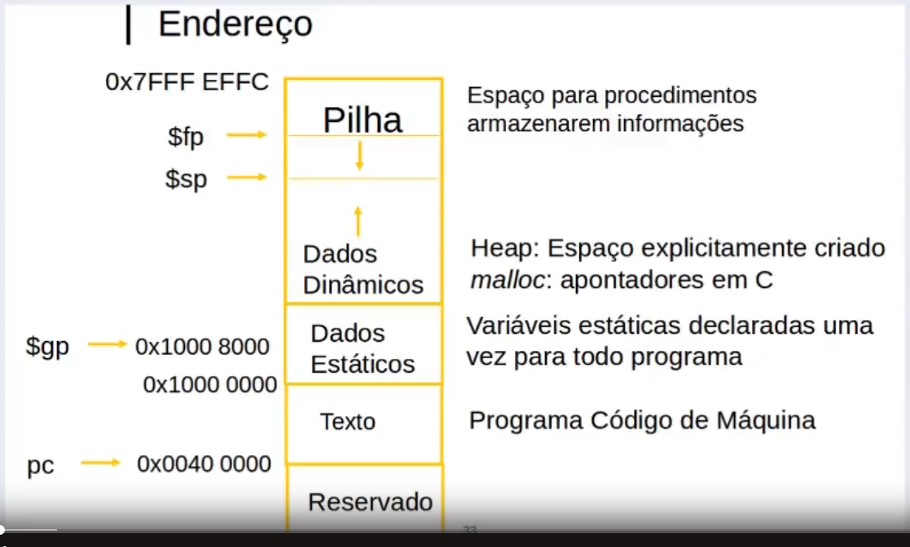
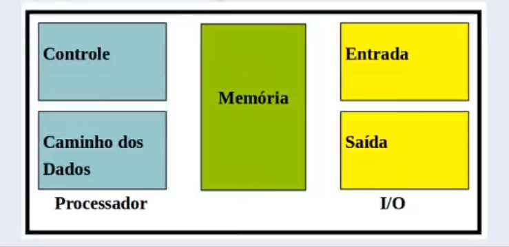
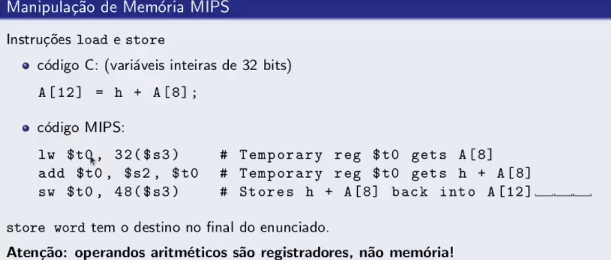

# Anotações para aula A de MIPS

## Abstração
 
* Não é necessário saber o que esta acontecendo por tras das cortinas, pois a interface abstrai os funcionamentos por tras dela, possibilitando que voce se concentre naquele ponto;

## Programação
* O compilador transforma o codigo em linguagem de montagem, que é a mesma coisa que o codigo compilado, mas de uma forma que o processador entende. O nome dessa linguagem é assembly. A transformação em linguagem de máquina costuma ser reversível.

* Depois de transformado em assembly, o programa deve ser carregado na memoria para ser executado.

* O processador digital é um automato que é programável que tem 3 missoes: fazer o fetch (buscar instrução na memoria), decodificá-la e executá-la.

# Anotações para aula B de MIPS
 
 A arquitetura usada sera RISK, ou seja, simples (em contrapartida da CISK). Hoje em dia, a maioria dos processadores usam conceitos advindos dessas duas filosofias.

Por que Assembly para MIPS (Microprocessor Without Interlocked Pipeline Stages)
 * Linguagem similar a ARMv7.

## A CPU MIPS contém 32 registradores de uso geral numerados de 0 a 31. O registrador n é designado po $n.
* Ela contém CPU (soma subtração). PPU (Pontos flutuantes), Coprocessor 0 (exceções)
 - Os registradores são as melhores tipos de memórias

# Especificações dos Registradores

# Anotações aula C MIPS

## Alocação de Memória (SPIM  e Mars)

# ESTRUTURA BASICA DE UM PROGRAMA
* .text: area do programa (instrucoes) em si;
* .data: area para declarações de variáveis estaticas
* .globl: area global de declaracao

## Linguagem de Máquina (De montagem)
* Mais primitiva que linguagens de alto nivel. Sem controle de fluxo sofisticado
* Muito Restritiva: MIPS Arithmetic Instrutions

## Modelo de programação: MIPS ISA
* OBJETIVO DE EFICIENCIA

## Aritmética MIPS
* Todas as instruções possuem 3 operandos
* A ordem é fixa
* No MIPS, add e sub são as operações
* Todos os operando devem ser registradores

## Registradores vs Memoria
* O registrador que associa variáveis a registradores
* Tudo que o processador faz passa pela memoria

## Exemplo de manipulação de Memoria no MIPS

* lw -> uso para pegar um dado de um array
* sw -> uso para gravar um dado num array

* Pra nao fazer 2 instruções, use assim:
* *addi $s3, $s3,4 ==  $s3 = s3 + 4*
